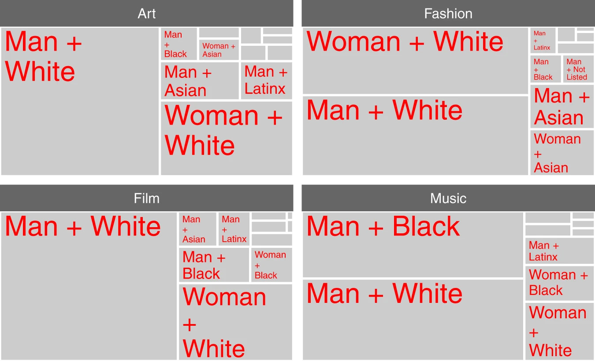
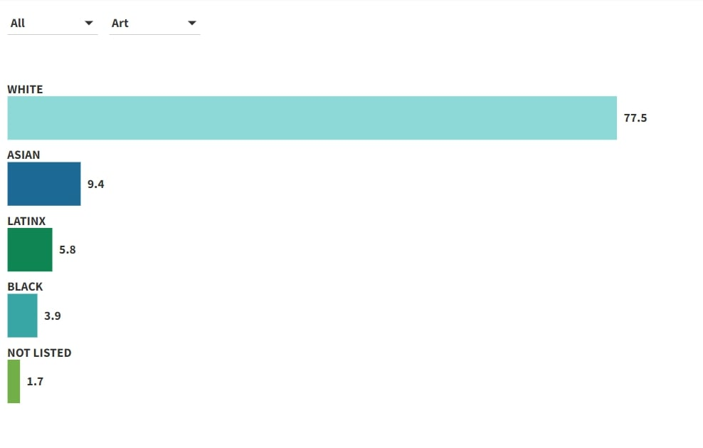
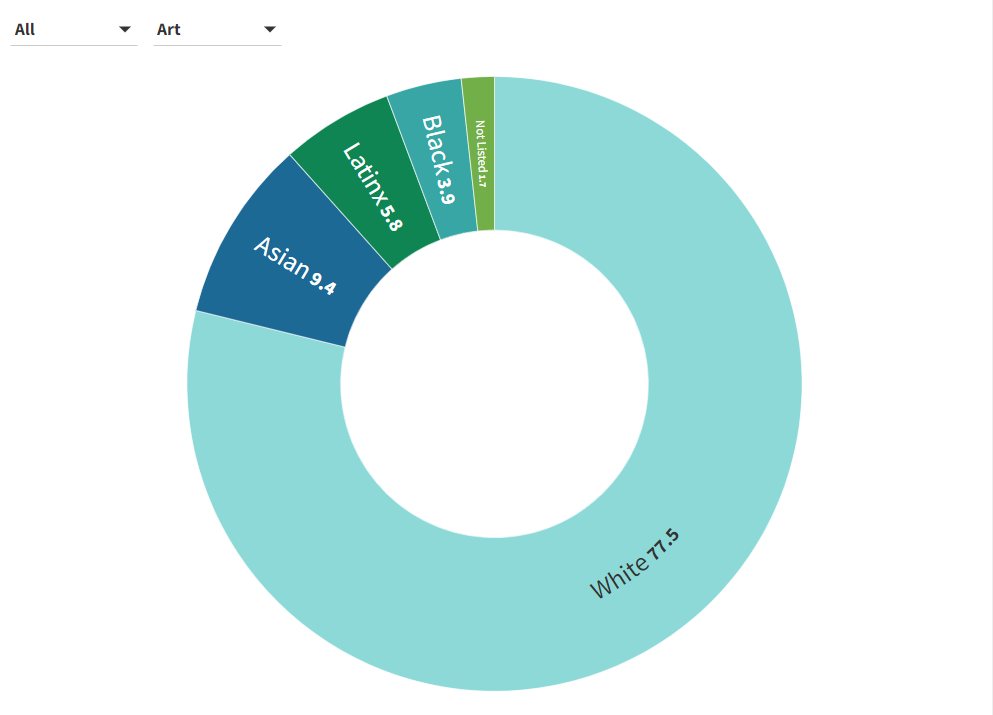
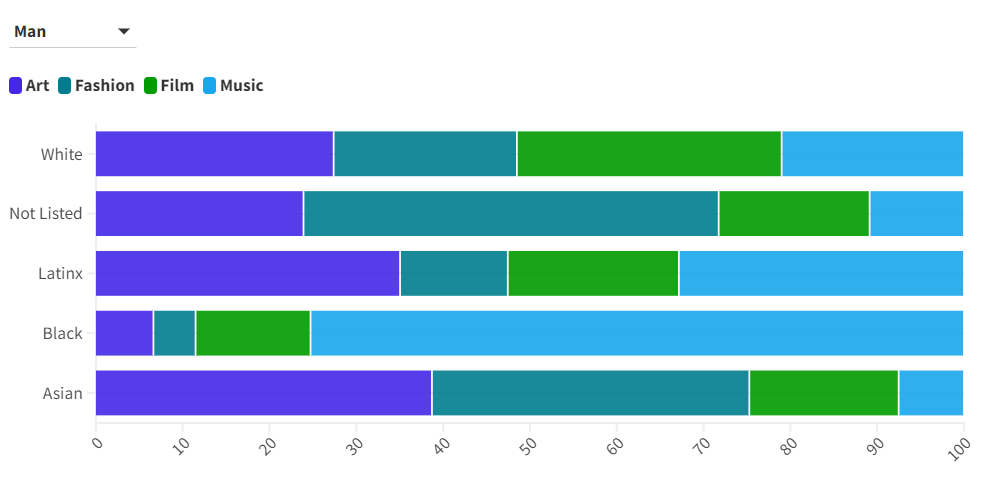

# Addressing Disparities in Creative Industries: Race and Gender Representation
## Data visualization for revision and redesign
#### Topaz, C.M., Higdon, J., Epps-Darling, A. et al. Race- and gender-based under-representation of creative contributors: art, fashion, film, and music. Humanit Soc Sci Commun 9, 221 (2022). https://doi.org/10.1057/s41599-022-01239-9.

> Photo by <https://www.nature.com/articles/s41599-022-01239-9/figures/3>

The selected data visualization is "*Fig. 3: Socially inferred intersecting gender-ethnicity within each creative domain, where each light gray rectangle represents proportion within the domain,*" which presents a visual representation of the gender and ethnicity intersections within the four creative domains (art, fashion, film, and music).
The choice of this particular data visualization is related to several reasons:
- The data provides a clear overview of the gender and ethnicity distribution within each creative domain.
- It can help professionals in creative industries recognize the need for greater diversity and inclusion efforts and can also serve as an eye-opener for the general public by providing a clear and tangible representation of the demographic composition in these fields.
- The data visualization could benefit from some enhancements as it currently lacks clarity. Here are some suggested improvements:
1. The use of red for emphasis could be seen as a drawback, as it might convey negative connotations or evoke strong emotions. A more neutral color might have been a better choice to avoid distraction.
2. The small text in smaller areas makes it difficult to read, and this can be a usability issue. It would be beneficial to improve the legibility of text in smaller sections.
3. Not having numerical data directly on the chart could be a limitation. Viewers have to refer to Table 1 for specific data, which can be inconvenient and disrupt the flow of understanding.
4. The title should be simplified for clarity and conciseness.
5. While a Treemap is a good choice, exploring other types of charts might enhance its overall effectiveness.

#### To make this graph more appealing to the art industry audience, consider adding more creativity and using vibrant colors.

##  A visual exploration of creative contributors
The following four charts represent a process of experimentation with various chart types. In my quest to make the data more comprehensible, I explored approximately 12 different chart options before narrowing them down to four that I believed were the most understandable. Subsequently, I conducted a survey involving three participants: a Ph.D. student, a 60-year-old adult, and a 26-year-old marketing student. 
Among the chart types tested, the line chart emerged as the most confusing. The Ph.D. student noted that it had a dense cluster of lines at the bottom, making it difficult to discern the data points. Moving on, we explored bar charts and donut charts, which were deemed visually more appealing. However, they still lacked the necessary level of detail, prompting questions from the 60-year-old participant.
The stacked bar chart, on the other hand, stood out as the clearest and most comprehensible data visualization option. It received positive feedback from all three participants. Notably, the marketing student recommended toning down the vibrancy of colors for improved readability. 
1. 
2. 
3. 
4. 

